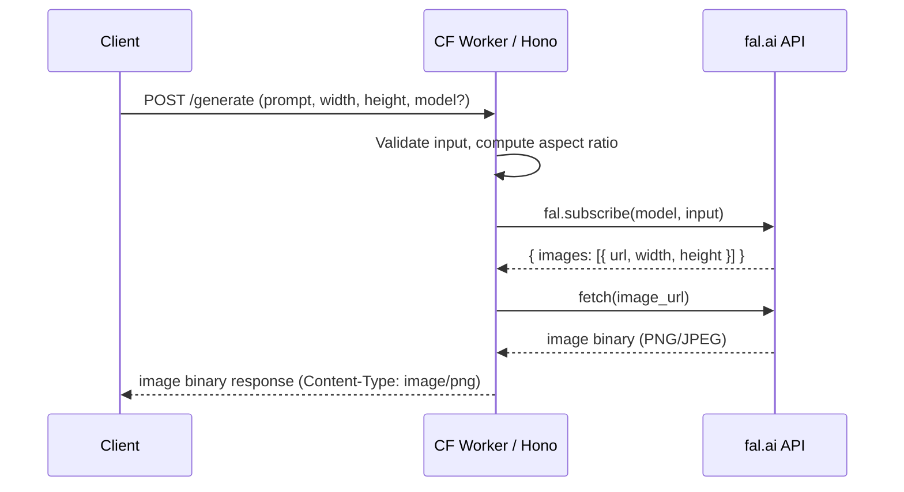

# Wallpaper Generator Cloudflare Worker

## Architecture



## Project Setup

Scaffold with the Hono Cloudflare Workers template, then add `@fal-ai/client` as a dependency.

```bash
npm create hono@latest . -- --template cloudflare-workers
npm install @fal-ai/client
```

The `FAL_KEY` API key will be stored as a Cloudflare Worker secret (configured in `wrangler.toml` as a binding, set via `npx wrangler secret put FAL_KEY`).

## File Structure

```
background-worker/
  src/
    index.ts          # Hono app, routes, main entry
  wrangler.toml       # Worker config (already scaffolded)
  package.json        # Dependencies (already scaffolded)
  tsconfig.json       # TypeScript config (already scaffolded)
```

We'll keep things in a single `src/index.ts` since the scope is small (one endpoint). Can split later if it grows.

## API Design

### `POST /generate`

**Request body (JSON):**

```typescript
{
  prompt: string;              // Required - wallpaper description
  width: number;               // Required - screen width in px (e.g. 1920)
  height: number;              // Required - screen height in px (e.g. 1080)
  model?: string;              // Optional - fal.ai model ID (default: "fal-ai/flux/schnell")
  negative_prompt?: string;    // Optional - what to avoid
  num_inference_steps?: number; // Optional - quality vs speed (model-dependent)
}
```

**Response:** Raw image binary with `Content-Type: image/png` (or jpeg depending on fal.ai output).

**Error responses:** JSON with appropriate HTTP status codes (400 for validation, 500 for fal.ai errors).

### `GET /models`

Returns a curated list of supported image generation models with their IDs and descriptions, so clients know what models are available.

### `GET /`

Health check / welcome endpoint.

## Implementation Details

### fal.ai Integration

Use `createFalClient` from `@fal-ai/client` to create a per-request client with the API key from Worker env:

```typescript
import { createFalClient } from "@fal-ai/client";

// Inside the route handler:
const fal = createFalClient({ credentials: env.FAL_KEY });

const result = await fal.subscribe(model, {
  input: {
    prompt,
    image_size: { width, height },
    negative_prompt,
    num_inference_steps,
  },
});

// result.data.images[0].url -> fetch this and return as binary
```

### Input Validation

- `prompt`: non-empty string, max 2000 chars
- `width` / `height`: integers, min 512, max 4096, must be divisible by 8 (common requirement for diffusion models)
- `model`: if provided, must be a string matching `fal-ai/*` pattern
- Use Hono's built-in validator or Zod for schema validation

### Supported Models (default list)

| Model ID                             | Description                  |
| ------------------------------------ | ---------------------------- |
| `fal-ai/flux/schnell`                | Fast, good quality (default) |
| `fal-ai/flux/dev`                    | Higher quality, slower       |
| `fal-ai/flux-pro/v1.1`               | Best quality, premium        |
| `fal-ai/stable-diffusion-xl-base-v1` | Classic SDXL                 |

### Binary Response

After fal.ai returns the image URL, fetch it and stream the response back:

```typescript
const imageUrl = result.data.images[0].url;
const imageResponse = await fetch(imageUrl);

return new Response(imageResponse.body, {
  headers: {
    "Content-Type": imageResponse.headers.get("Content-Type") || "image/png",
    "Content-Disposition": "inline",
    "Cache-Control": "public, max-age=86400",
  },
});
```

### Environment / Secrets

- `FAL_KEY` - fal.ai API key, set via `npx wrangler secret put FAL_KEY`
- Typed in `wrangler.toml` or a `worker-configuration.d.ts` file for TS support
